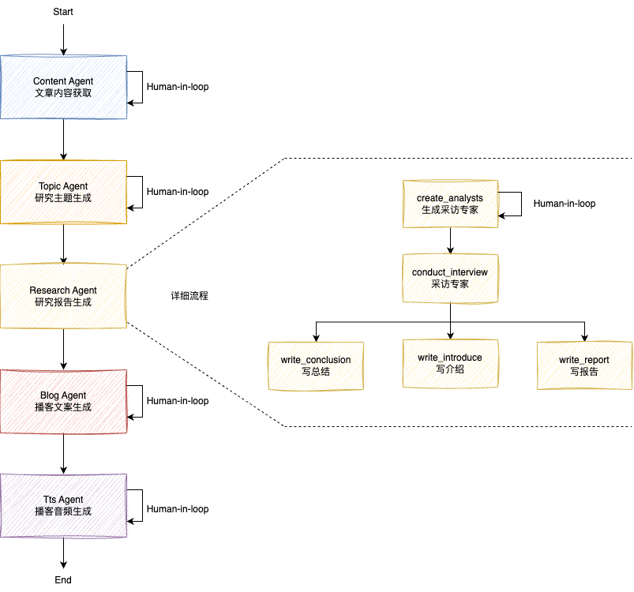
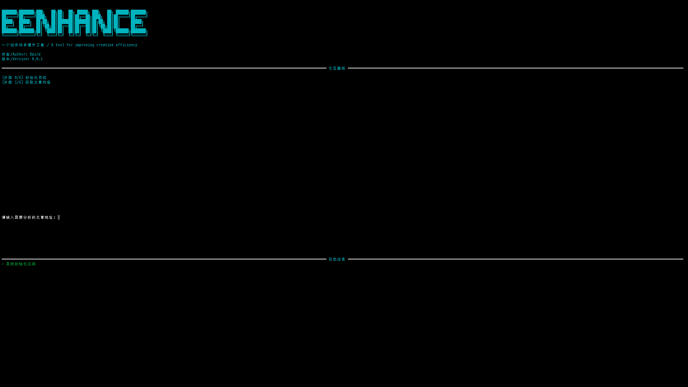

# 🚀 EEnhance

简体中文 | [English](README-en.md)

<p>
	<p align="center">
		
	</p>
	<p align="center">
		<br>
		<b face="雅黑">基于LangGraph的研究报告播客生成Agent</b>
	<p>
</p>
<p align="center">


</p>

## 🌰 示例

**示例一：**

- URL 地址：[69 天探索操作系统-第 32 天：中断处理的艺术](https://juejin.cn/post/7458179892377042970)
- 研究报告：[1. 中断处理中的优先级管理与嵌套中断机制优化研究.md](./docs/demo/data/report/1.%20中断处理中的优先级管理与嵌套中断机制优化研究.md)
- 播客文案：[1. 中断处理中的优先级管理与嵌套中断机制优化研究\_blog.txt](./docs/demo/data/transcripts/1.%20中断处理中的优先级管理与嵌套中断机制优化研究_blog.txt)
- 播客音频：合成采用 `Fish Audio`

**示例二：**

- URL 地址：[69 天探索操作系统-第 41 天：进程同步](https://juejin.cn/post/7462210754361376779)
- 研究报告：[1. 基于无锁编程的并发数据结构优化研究.md](./docs/demo/data/report/1.基于无锁编程的并发数据结构优化研究_blog.md)
- 播客文案：[1. 基于无锁编程的并发数据结构优化研究\_blog.txt](./docs/demo/data/transcripts/1.基于无锁编程的并发数据结构优化研究_blog.txt)
- 播客音频：合成采用 `Fish Audio`

<table>
<tr>
<td align="center">

**示例一**

</td>
<td align="center">

**示例二**

</td>
</tr>
<tr>
<td align="center">

[示例一](https://github.com/user-attachments/assets/f0e320b1-59e3-474d-ba77-9a2165bb14c2)

</td>
<td align="center">

[示例二](https://github.com/user-attachments/assets/fdf73a50-9452-4581-8980-31cd4f5fa47e)

</td>
</tr>
</table>

## 📖 项目介绍

采用 DeepSeek 通过 5 个 Sub-Agent 组合构建出一个研究和创作工具 Agent，能够完成从在线网站提取文章内容，确定研究主题到生成研究报告、播客文案和音频合成等全工作流。

<p align="center">
		<br>
		<b face="雅黑">EEnhance流程架构图</b>
<p>

### 核心流程

- Content Agent: 给定一个文章 URL 地址获取文章内容
- Topic Agent: 生成进一步研究主题并选择
- Research Agent: 基于研究主题，通过采访提问的方式生成研究报告
  - create_analysts: 基于研究主题，生成一组专家角色
  - conduct_interview: 通过采访交流的方式分别向这组专家提问，并生成采访内容
  - write_conclusion\write_introduce\write_report: 通过整合采访内容生成一个研究报告文件
- Blog_Agent: 基于研究报告文件，针对性生成对应的播客文案（双人对话）
- Tts_Agent: 将播客文案合成音频

### 目录结构

```shell
eenhance/
├── blog/            # 博客文案Agent
├── content/         # 内容提取Agent
├── research/        # 研究报告Agent
├── topic/           # 主题生成Agent
├── tts/             # 语音合成Agent
├── ui/              # 终端界面
├── utils/           # 工具函数
├── config.yaml      # 主配置文件
├── conversation_config.yaml      # 播客文案和语音合成配置
├── constants.py     # 常量定义
├── main.py          # 主程序
└── __main__.py      # 命令行入口
```

## 部署运行

> [!Warning]  
> 💡 目前本项目暂时只支持终端运行，Web 版正在路上

- 安装依赖

```shell
# 克隆项目代码到本地
git clone https://github.com/ptonlix/EEnhance.git
conda activate eenhance # 激活环境
cd EEnhance # 进入项目
poetry install # 安装依赖
```

- 配置 API KEY

```shell
vim .env
```

```ini
TAVILY_API_KEY=xxx ## Tavily 搜索API

DEEPSEEK_API_BASE=https://api.deepseek.com/v1
DEEPSEEK_API_KEY=xxx # Topic Agent & Research Agent 用到，可以尝试使用其它模型

FISH_API_KEY=xxx # 音频合成推荐
```

音频合成支持平台包括：` openai` `edge ` `fish audio`等

[Fish TTS](https://fish.audio/zh-CN/) 中文音频合成效果较好，本项目推荐使用

具体模型配置请结合项目配置文件`config.yaml` `conversation_config.yaml`使用

- 启动程序

```shell
python -m eenhance
```



根据终端指示，复制粘贴 URL 地址，随后一步步完成整个工作流

## 🚩 Roadmap

- [] 构建网页版本，方便流程体验

## 🌏 项目交流讨论


🎉 扫码联系作者，如果你也对本项目感兴趣  
🎉 欢迎加入 LangChain-X (帝阅开发社区) 项目群参与讨论交流

## 💥 贡献

欢迎大家贡献力量，一起共建 EEnhance，您可以做任何有益事情

- 报告错误
- 建议改进
- 文档贡献
- 代码贡献  
  ...  
  👏👏👏

---
